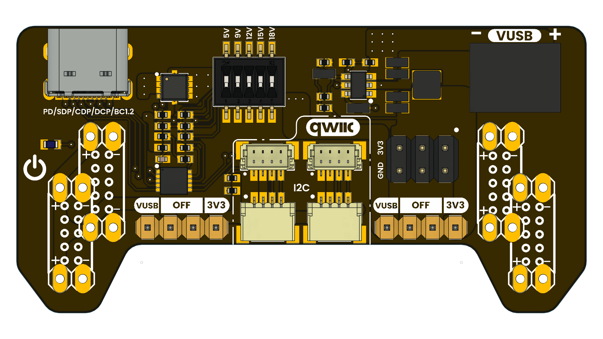

# DevLab: Power Supply for Breadboard with QWIIC
<!-- Exception:

The PULSAR development board line does not use the DevLab: prefix.

Format: PULSAR [MCU/Model]

Examples: PULSAR C6, PULSAR H2, PULSAR RP2350

The JUN R3 board also does not use DevLab:

Example: JUN R3 -->

## Introduction

The Breadboard Power Supply with Load Decoy and QWIIC Connectors is a compact and versatile module designed to power electronic projects in a practical and safe way. It allows power to be supplied through QWIIC connectors or via USB-C chargers compatible with technologies such as Power Delivery (PD), Quick Charge (QC), or Battery Charging (BC).

  
  
<em>Power Supply for Breadboard with QWIIC</em>

### Quick Setup

## Overview

| Feature                | Description                                                      |
|------------------------|------------------------------------------------------------------|
| USB PD IC              | HUSB238                                                          |
| Compatible voltages    | 3.3V, 5V, 9V, 12V, 15V, 18V, 20V                                 |
| Maximum output current | 5A                                                               |
| Power Supply           | USB-C                                                            |
| Interfaces             | I2C, PD3.0m type-C V1.4, Apple Divider 3, BC1.2 SDP, CDP and DCP |
| Form Factor            | Designed for breadboards                                         |
| Expansion Port         | I2C connector for sensors and modules                            |

* **Note:** Output voltages and currents may vary with the characteristics of the power supply  

## Applications

- **Electrical consumption testing:** helps power prototypes while evaluating circuit behavior under different voltages or load conditions.

- **Breadboard prototype power supply:** allows test circuits to be powered in an organized way, using selectable voltage outputs and a regulated 3.3 V output.

- **Microcontroller testing:** useful for powering boards such as ESP32, Arduino, Raspberry Pi Pico, STM32, or other embedded systems that require stable power.

- **I2C sensor projects:** thanks to the QWIIC/STEMMA QT connectors, it makes it easier to connect compatible sensors without complex wiring.

- **USB-C PD powered projects:** allows modern USB-C chargers to be used to obtain different voltage profiles, such as 5 V, 9 V, 12 V, 15 V, or 20 V, depending on the configuration and the charger used.

- **Embedded systems development:** can be integrated during the development stage to power control circuits, sensors, and peripherals before designing a final power supply on a PCB.

- **Low- and medium-power actuator testing:** powers small motors, servos, relays, or actuators, always respecting the module’s current and voltage limits.

## Resources

- [Schematic Diagram](#)
- [Pinout Diagram](#)
- [Getting Started Guide](#)

## 📝 License

All hardware and documentation in this project are licensed under the **MIT License**.  
See [`LICENSE.md`](LICENSE.md) for details.

  Template created by UNIT Electronics

