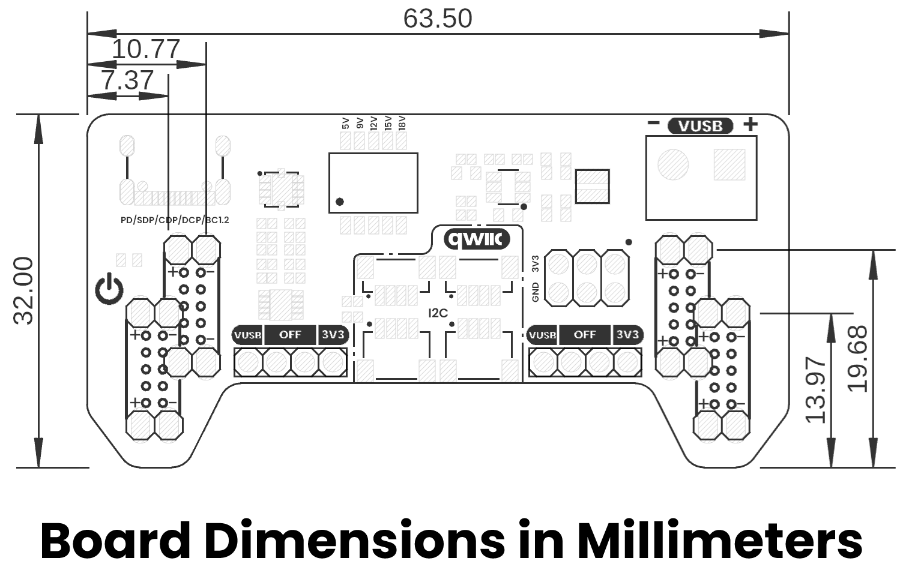
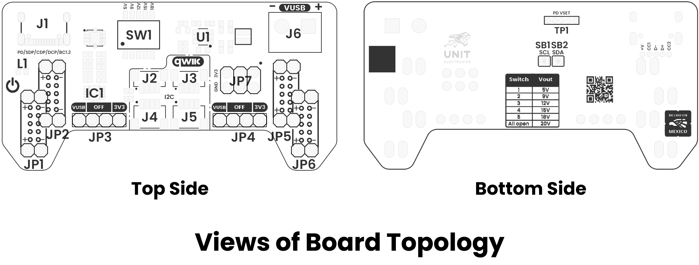

# Hardware

<a href="./unit_schematic_v_1_0_0_ue0113_devlab_power_supply_for_breadboard_with_qwiic.pdf"> Schematic</a>

## Key Technical Specifications

| **Parameter** | **Description** | **Min** | **Typ** | **Max** | **Unit** |
|:---:|:---|:---:|:---:|:---:|:---:|
| Vin | USB Type-C PD input voltage | 5 | - | 20 | V |
| VBUS | USB PD negotiated output voltage | 5 | 9 / 12 / 15 | 20 | V |
| V3V3 | Regulated 3.3V output rail | 3.2 | 3.3 | 3.4 | V |
| I3V3 | Maximum 3.3V regulator output current | - | - | 2 | A |
| IBUS | Maximum breadboard output current | - | - | 5 | A |
| VIH | High-level input voltage for I²C | 0.7 × VCC | - | 5.5 | V |
| VIL | Low-level input voltage for I²C | - | - | 0.3 × VCC | V |
| ICC | Typical module supply current | - | 3.1 | - | mA |
| fI2C | Supported I²C communication frequency | 0 | 100 | 400 | kHz |
| TOPD | USB Power Delivery supported profiles | 5 | 9 / 12 / 15 | 20 | V |
| TAMB | Recommended operating ambient temperature | -20 | 25 | 85 | °C |

> **Note 1:** USB Power Delivery voltage selection can be configured through the onboard DIP switch resistor network or dynamically through the HUSB238 I²C interface. I²C configuration has priority over DIP switch settings.

> **Note 2:** The 3.3V regulator output capability depends on thermal dissipation, PCB airflow, and input voltage conditions.

> **Note 3:** Qwiic/STEMMA QT connectors share the same I²C bus signals (3V3, GND, SDA, SCL) for daisy-chain operation.

> **Note 4:** The maximum VBUS/PD output current depends on the power capability, voltage profile, cable quality, and electrical characteristics of the connected USB Type-C PD power adapter.

> **Note 5:** The module integrates breadboard-compatible power rails with selectable VUSB and regulated 3.3V outputs.
 

* **Note:** Output voltages and currents may vary with the characteristics of the power supply

## Pinout

<a href="./unit_pinout_v_1_0_0_ue00113_Power_Supply_for_Breadboard_with_Qwiic_en.pdf">
 
Pinout
</a>

    
## Pin & Connector Layout

| Pin Label | Function | Notes |
|---|---|---|
| VUSB | USB Power Delivery output rail | Selectable PD voltage output (5V, 9V, 12V, 15V, 20V) |
| 3V3 | Regulated 3.3V output | Generated by onboard TPS54302 regulator |
| GND | Ground reference | Common ground for power and signals |
| SDA | I²C serial data line | Connected to Qwiic/STEMMA QT interface and HUSB238 |
| SCL | I²C serial clock line | Connected to Qwiic/STEMMA QT interface and HUSB238 |
| USB-C | USB Type-C PD input connector | Power input supporting USB Power Delivery |
| DIP SW | PD voltage selection switch | Selects PD negotiation voltage profile |
| QWIIC | Qwiic/STEMMA QT connector | JST 1.0 mm connector for I²C peripherals |
| VOUT | Breadboard power output | Output rail for external circuits and breadboards |
| GND OUT | Breadboard ground output | Ground rail for external circuits and breadboards |
| Header A | Breadboard interface header | Power rail connection for breadboard integration |
| Header B | Auxiliary power header | Provides VUSB, 3V3, and GND outputs |

> **Note:** The Qwiic/STEMMA QT connectors share the same SDA and SCL bus lines and are intended for daisy-chain I²C connectivity.

> **Note:** Only one jumper configuration should be used at a time to avoid electrical conflicts or damage.

## Dimensions

<a href="./resources/unit_dimension_v_1_0_0_ue0113_devlab_power_supply_for_breadboard_with_qwiic.png">  Dimensions</a>

## Topology

<a href="./resources/unit_topology_v_1_0_0_ue0113_devlab_power_supply_for_breadboard_with_qwiic.png">  Topology</a>
 
 
 

| Ref.    | Description                                        |
|---------|----------------------------------------------------|
| J1      | USB Type-C Connector                               |
| L1      | Power On LED                                       |
| IC1     | HUSB238                                            |
| SW1     | Dip Switch for voltage selector                    |
| U1      | TPS54302 3.3V Regulator                            |
| J6      | Screw Terminal Block output for VUSB               |
| JP7     | Pin Header for 3V3 power supply                    |
| JP3     | Output voltage selector for the left side headers  |
| JP4     | Output voltage selector for the right side headers |
| JP1-JP2 | Left side output voltage headers for breadboard    |
| JP5-JP6 | Right side output voltage headers for breadboard   |

## Pin & Connector Layout
| Pin   | Voltage Level | Function                                                  |
|-------|---------------|-----------------------------------------------------------|
| VCC   | 3.3 V – 5.5 V | Provides power to the on-board regulator and sensor core. |
| GND   | 0 V           | Common reference for power and signals.                   |
| SDA   | 1.8 V to VCC  | Serial data line for I²C communications.                  |
| SCL   | 1.8 V to VCC  | Serial clock line for I²C communications.                 |

> **Note:** The module also includes a Qwiic/STEMMA QT connector carrying the same four signals (VCC, GND, SDA, SCL) for effortless daisy-chaining.

# References

- <a href="./resources/unit_datasheet_v_1_0_0_ue0113_husb238.pdf">HUSB238 Datasheet </a>
- <a href="./resources/unit_datasheet_v_1_0_0_ue0113_tps54302.pdf">TPS54302 Datasheet </a>
