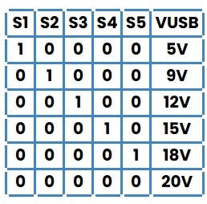

# Software

This directory contains the software examples for communicating with the
HUSB238 USB-C Power Delivery controller on the DevLab Power Supply for
Breadboard with Qwiic.

## Current support

The repository currently provides one C++ example:

- [`husb238_detection_only`](examples/cpp_examples/husb238_detection_only/husb238_detection_only.ino)
  detects the HUSB238 over I2C and reports the USB-C PD voltage profiles
  advertised by the connected power source.

The example is detection-only. It does not request a different voltage, change
the active USB-C PD contract, or control the 3.3 V output.

## Directory structure

```text
software/
├── README.md
└── examples/
    ├── README.md
    └── cpp_examples/
        └── husb238_detection_only/
            └── husb238_detection_only.ino
```

## Requirements

- A C++-compatible controller with an I2C interface
- **Adafruit HUSB238 Library**
- **Adafruit BusIO**
- A serial terminal configured for **115200 baud**
- A USB-C power adapter that supports USB Power Delivery
- A Qwiic/STEMMA QT cable or equivalent I2C connection

## Connection

Connect the external controller to the power-supply module through its
Qwiic/STEMMA QT port.

| Signal | Default controller pin | Description |
|---|---:|---|
| SDA | 6 | I2C data |
| SCL | 7 | I2C clock |
| 3.3 V | — | I2C logic supply |
| GND | — | Common ground |

The SDA and SCL values are example defaults for UNIT Electronics RP2040
controllers. If another controller is used, update these definitions in the
sketch:

```cpp
#define HUSB238_I2C_SDA 6
#define HUSB238_I2C_SCL 7
```

The HUSB238 uses `HUSB238_I2CADDR_DEFAULT`, as defined by the driver library.

## Running the example

1. Install the Adafruit HUSB238 Library and Adafruit BusIO in the C++
   development environment.
2. Connect the controller to the module over I2C.
3. Connect a USB-C PD power adapter to the module.
4. Open
   [`husb238_detection_only.ino`](examples/cpp_examples/husb238_detection_only/husb238_detection_only.ino)
   and select the correct target board and serial port.
5. Build and upload the sketch.
6. Open the serial terminal at 115200 baud.

When communication succeeds, the output lists the voltage profiles advertised
by the connected USB-C PD source:

```text
Initializing HUSB238...
HUSB238 detected.
Available USB-C PD voltages:
- 5 V
- 9 V
- 12 V
```

The available profiles depend on the connected adapter. If the controller
cannot communicate with the module, verify the I2C pins, power, ground, and
Qwiic/STEMMA QT connection.

## Voltage-selection behavior

The module can select a USB Power Delivery voltage through either the onboard
DIP-switch resistor network or the HUSB238 I2C interface. An I2C configuration
takes priority over the DIP-switch setting.

The DIP switch can request 5 V, 9 V, 12 V, 15 V, or 20 V when that profile is
supported by the connected adapter.



Always verify that the adapter, USB-C cable, selected voltage profile, and load
support the required voltage and current before powering a circuit.

## More information

- [Examples guide](examples/README.md)
- [Hardware documentation](../hardware/README.md)
- [HUSB238 datasheet](../hardware/resources/unit_datasheet_v_1_0_0_ue0113_husb238.pdf)
- [Module schematic](../hardware/unit_sch_v_1_0_0_ue0113_devlab_power_supply_for_breadboard_with_qwiic.pdf)
